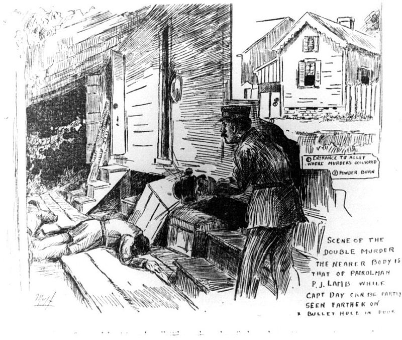

# History

New Orleans was an important port city in the Southern United States.  It had been a
robust slave society until the resolution of the Civil War.  The society relied heavily
on slave labor.  After the Civil War, many of the freed slaves remained in New Orleans.  
The Census of 1900 states that there were 730,000 whites and 650,000 Negroes living in
New Orleans.  Although the blacks were now “legally free” many Jim Crowe laws were passed
by 1900 to hold the line on racial equality.

Plessey v Ferguson, a famous Supreme Court Case originated in Louisiana, established the
right of states to establish separate but equal accommodations.  This was a tense time
for racial relations in New Orleans and this decision added to the animosity.  A certain
retired military officer tried his hand at journalism add made things significantly worse.  
He basically pushed the idea of a race war that would solve the problem “once and for all.”  
He advocated a race war that would end in the extermination of all Negros in Louisiana.

This racial tension culminated in the case of Robert Charles.  He was a mixed race man in
New Orleans.  He was questioned by police and it turned into an altercation with Charles
escaping.  He was later confronted by the police and was shot.  He also shot and killed a
police officer in the exchange.  Charles, once again escaped and a manhunt ensued.

A crowd gathered at the scene and insisted on lynching Charles.  The police dispersed the
crowd by telling them that Charles was in jail, though he was still on the loose.  Upon
this realization, riots began.  Many whites and blacks were hospitalized and 3 were killed.
Finally, Charles was located.  He had taken refuge in a house in New Orleans.  Throughout
the day shots were exchanged.  By the end of the incident, Charles had shot 27 people,
killing seven.

This is the environment that I wish to study.  How were blacks treated by the police as
compared to whites and other races and classes.  Did the New Orleans Police Department
overly charge blacks with vagrancy in order to fill the chain gangs needed to maintain
the city.  How did these decisions contribute to the racial tensions of the year 1900
in New Orleans.
