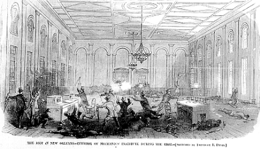

# Next Steps

The ability to digitize data gives us many opportunities to ask questions we were unable to
ask in the past.  Once all the records have been digitized many areas can be explored.
I would like to attempt to map all the crimes in these records on an historically accurate
map from 1900.  this will require GPS mapping and tracing the renaming of streets since 1900.
This would tell us which areas of the city of New Orleans were most frequently the site of arrests.
This information can then be compared over time to see the changing socio-economic status of
different areas of the city.
