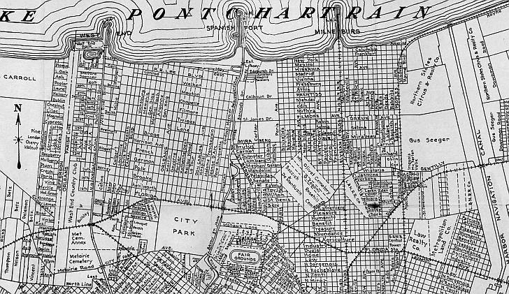

## Source Analysis

# Sources and Type
My sources are copies of original arrest records from New Orleans in the year 1900.  The originals are kept on microfilm in the New Orleans Public Library and were scanned by Dr. Steven Prince of the University of South Florida’s history Department.  

# Organizations Responsible
The people who are responsible for creating the data originally are the New Orleans Police Department from the year 1900.  

# Digitizing the Data
I personally entered the data by hand.  One possible issue is some of the records were a bit hard to read.  Old hand writing can be tough to decipher, especially when the ink bleeds all over the paper.  The only other problem which I have encountered is there are some colloquialisms in the source that are not used today.  For example, for one man under race the officer wrote “Pollock”.  If there are too many individual “races” it may throw the numbers off a bit.

# Process
This project was constructed to accurately reflect the data available.  It was necessary to normalize some of the data regarding the crimes committed.  For example the crimes were not very uniform in the way entered.  Sometimes it would say assault, another time it would say stabbing and wounding and another time it would say drunken brawl.  So things of like nature would be narrowed down with a more specific crime kept in the note section.

# Funding
Dr. Stephen Prince has obtained funding to cover the digitizing of the data.

# Viewpoints
The only viewpoint reflected in the data would come from the original record hand written by the officers of the New Orleans Police Department.

# Goals
Our goal in this project is to supplement the scholarship on inequalities in New Orleans in 1900.
