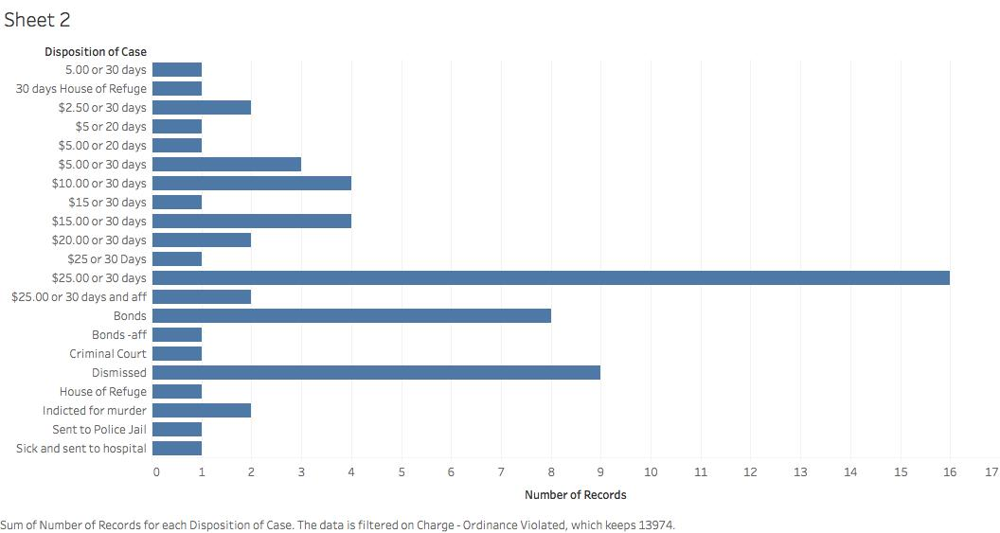

# Transparency Report

	My data source is the New Orleans Police Department arrest record from the year 1900.  
    I was given copies of the originals and transcribed them into a spreadsheet for easier
    analysis.  Once in the spreadsheet, it had to be cleaned to make it actually useful.  
    I used Open Refine for this process.  It was necessary to ‘normalize’ certain categories,
    most often the actual reason for arrest.

## Sheet 1
	I think that this visualization is interesting because you can see that blacks were far
    more likely to be arrested for a 13974 Violation.  Blacks have always been said to be more
    likely to be used in chain gangs after the Civil War.  This Visualization adds to the
    evidence of this inequality.

## Sheet 2
	This Tableau Visualization is far more interesting.  As you can see, the outcome of almost
    all the cases involve the choice between a fine or thirty days in jail.  The majority of
    the cases that were not dismissed were $25 or 30 days in jail.  In 1900, most people did
    not have $25 and would have to spend the 30 days in the jail.  Once transported to the
    jail they could be put on a chain gang and used for public works.
