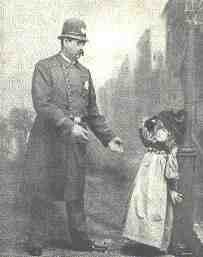

# Arresting Inequalities

# Introduction
	The records of the New Orleans Police Department can provide us with many insights.  Since the advent of
    Digitial Scholarship, information that was once inaccessible has now become accessible. This data will
    allow us to explore the vagrancy laws in New Orleans and its relation to the need for a labor force to
    maintain the city.  There was a law on the books, Order: 13974, which was used to arrest people for vagrancy.  
    At this same time, the county could still use its prisoners as a labor force.  I believe the two are connected.  
    I believe that the county put this law on the books so that it could arrest more people and use them to work
    on roads and other public works.
